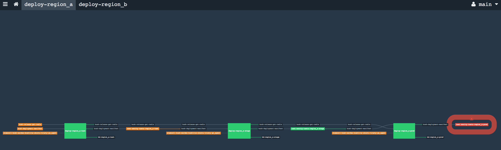

# Boshifier: To help continously deploy bosh releases 

Create concourse pipelines based out of the deployment configurations provided. 

Here is the basic workflow at this moment
* User to keep bosh releases and deployment manifests in git repos
* User to run Boshifier any of the supporting modes (see below) providing the following details
  * Credentials to target bosh directors
  * Credentials to target concourse
  * Deployment configurations
    * Release[s] git repo urls and branch
    * Bosh deployment manifest repo, branch and path
    * Stemcell[s]
  * Targets to be deployed with 

Once boshifier get the request, It create a pipeline to said concourse target which does below stuffs

* Get bosh releases and bosh deployment manifest from provided git repos
* Create bosh release tar.gz out of release source get from the repos
* Get stemcells from bosh.io
* Deploy releases to bosh target provided

# Features
* Deploy release code from any git repo
    * Pull release code from git repo, Create release tarball, and deploy it to provided director
* Deploy bosh release
    * Download bosh release from bosh.io and deploy to provided director
* Deploy multi-release, multi-stemcell manifests
* Deploy to multiple environments with different stages in each environment.

Note: Please refer [Configuration Reference](examples/deployment.yml)

# How to Use

## Install the requirements
```
$ cd boshifier
$ pip install requirements.txt
```

## Start boshifier in debug mode
Boshifier may be initialized with all required configurations loaded. All the bosh/concourse credentials
and target definitions may be good candidates for configurations. Such configurations need to be added
to the file /etc/boshifier/config.yml file. Please refer [example configurations](examples/)

NOTE: The configuration file can be changed by setting an environment variable BOSHIFIER_CONFIG_FILE which
point to a configuration file path.

```
$ cd boshifier
$ python main.py
 * Running on http://127.0.0.1:5000/ (Press CTRL+C to quit)
 * Restarting with stat
 * Debugger is active!
 * Debugger PIN: 937-515-728
```

## Use curl to do a deployment
```
$ curl -v -X POST http://127.0.0.1:5000/ -F f=@examples/deployment.yml
* Hostname was NOT found in DNS cache
*   Trying 127.0.0.1...
* Connected to 127.0.0.1 (127.0.0.1) port 5000 (#0)
> POST / HTTP/1.1
> User-Agent: curl/7.35.0
> Host: 127.0.0.1:5000
> Accept: */*
> Content-Length: 2486
> Expect: 100-continue
> Content-Type: multipart/form-data; boundary=------------------------32b8290d72d8cddd
> 
< HTTP/1.1 100 Continue
* HTTP 1.0, assume close after body
< HTTP/1.0 200 OK
< Content-Type: text/html; charset=utf-8
< Content-Length: 15
* Server Werkzeug/0.12.2 Python/2.7.6 is not blacklisted
< Server: Werkzeug/0.12.2 Python/2.7.6
< Date: Fri, 14 Jul 2017 14:30:29 GMT
< 
* Closing connection 0
Deployment done
```
## Use curl to see any deployment targets configured
```
$ curl http://127.0.0.1:5000/targets
{
  "region_a": {
    "stages": [
      {
        "test": {
          "bosh": "bosh_test_reg_a"
        }
      },
      {
        "stage": {
          "bosh": "bosh_stage_reg_a"
        }
      },
      {
        "prod": {
          "bosh": "bosh_prod_reg_a"
        }
      }
    ]
  },
  "region_b": {
    "stages": [
      {
        "stage": {
          "bosh": "bosh_stage_reg_b"
        }
      },
      {
        "prod": {
          "bosh": "bosh_prod_reg_b"
        }
      }
    ]
  }
}

```
## One may optionally run it as commandline tool too
```
$ python main.py -h
usage: main.py [-h] [-c] [config_files [config_files ...]]

Manage bosh deployments

positional arguments:
  config_files   Yaml file[s] that contain bosh and concourse credentials and
                 deployment config. One may submit single yaml file which
                 contain all configs or can submit multiple yaml files

optional arguments:
  -h, --help     show this help message and exit
  -c, --command  Run boshifier as commandline tool

$ python main.py -c examples/deployment.yml

```

# Sample pipeline screenshot


# TODO
* Stemcells map to resolve cpi specific stemcell name from os and get cpi details from bosh director
* Blobstore configurations to populate config/private.yml or use local blobstore in config/final.yml if not there
* Each target should have pipeline setup like deploy -> test -> declare pass/fail and notify
* Way to set cloud-config 
    * Define hardware profiles with set of common names, so that those generic names can be used within bosh deployment
    manifests to make them cloud agnostic
* Way to set runtime-config to have something available to all nodes or nodes in specific profiles
* Notify in case of failure or/and successful deployment
    * May be config to whom and/or what to be notified and how
* Create release once and push tar file somewhere centrally so that it can be used in other places. 
* It may have multiple concourse systems
* Reduce the logic in jinja2 template
    - Currently there are lot of logic in the template, which need to be cleaned
    - we may have python functions that make dictionary to make resultant yaml rather than using jinja2 template
    - that may make the system more composable
* Set a deploy_trigger_policy - to set if deployment to be triggered if all release builds are succeeded or otherwise

# Sample configs

* [Bosh credentials](examples/bosh.yml)
* [concourse credentials](examples/concourse.yml)
* [Deployment configuration](examples/deployment.yml)
